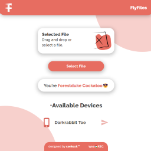

# FlyFiles, a file sharing app over WEB!

This project meant to be a LAN(?) File transfer app. Here's a live [link](https://fly-files.vercel.app/).

## The work done down below.

-UI Work. ✅  
-Mobile or Desktop detection. ✅  
-Websockets connection. ✅  
-WebRTC signalling and handshaking. ✅  
-Sending file datas through RTCDataChannels. ✅  
-Recreating blobs on the end client to create the end file. ✅  
-Recieved file alert. ✅  
-Separating your connections with your own LAN so you could only transfer with yourself. ✅  
...

## Maybe in the future...

-ID system (so users can share files each other easily over different networks).  
-Rooms for multiple people (A user would be able to share a file to the whole room).  
-More security.  
-Better UI Work.
