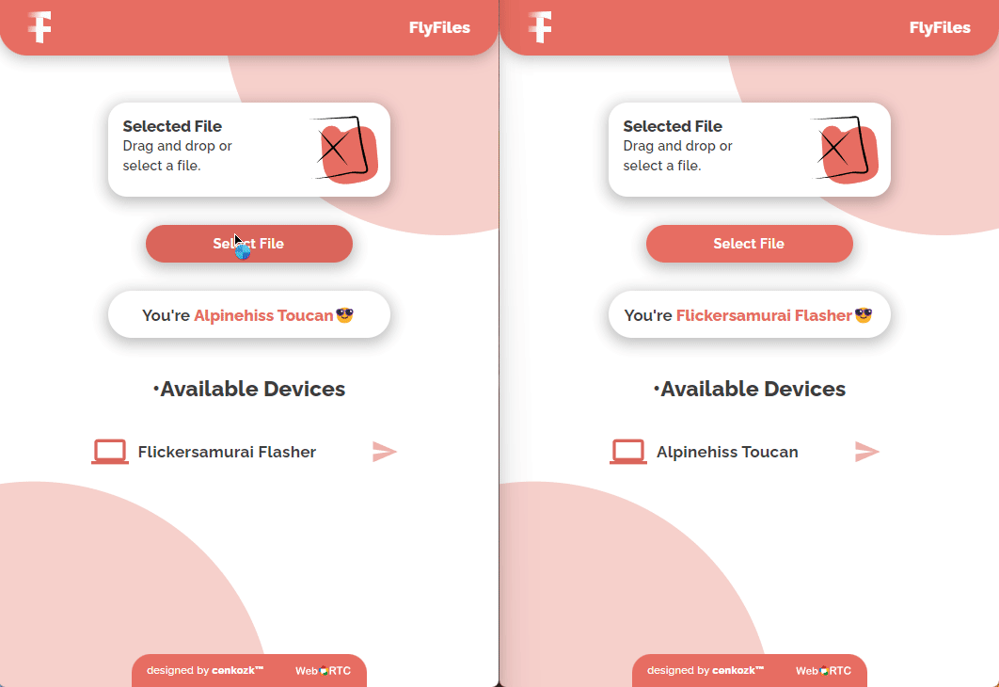

# FlyFiles, a WebRTC file sharing app.
**This app intended to be a clone of AirDrop like system.**  
 

FlyFiles basically sorts out all the current websockets and seperates them with their LAN devices. 
So if you're connected to same network, you can simply share your any size file over network with RTCDataChannels.
